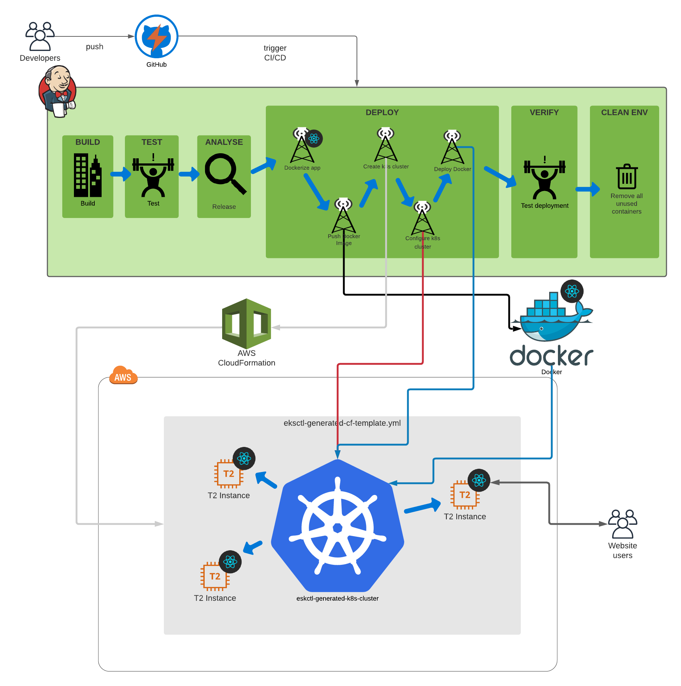

# Deployment of a create-react-app application in AWS through a Jenkins pipeline using Docker and Kubernetes

## Stack

### Software

- NodeJS
- ReactJS
- Webpack
- Babel

### CI/CD

- Github
- Jenkins
- AWS cli
- eksctl
- Docker
- Kubernetes

## Overview

## Deployment

- Create a new IAM profile for the deployment on AWS.
- Create an Ubuntu 20.04 Server t2.medium EC2 instance, SSH into it and install Jenkins, eksctl, kubectl, docker, awscli
- Configure Jenkins with aws-credentials, docker-credentials, github-credentials, the requires plugins to run pipeline like pipeline-aws and create a new pipeline that pull your github repo and use the Jenkinsfile inside it to deploy your react app.
- Run your pipeline
- Browser the External Ip of k8s loadBalancer given in the logs of the pipeline
- Make sure to reload your browser whithout cache (Ctrl + F5) after a change in the app

